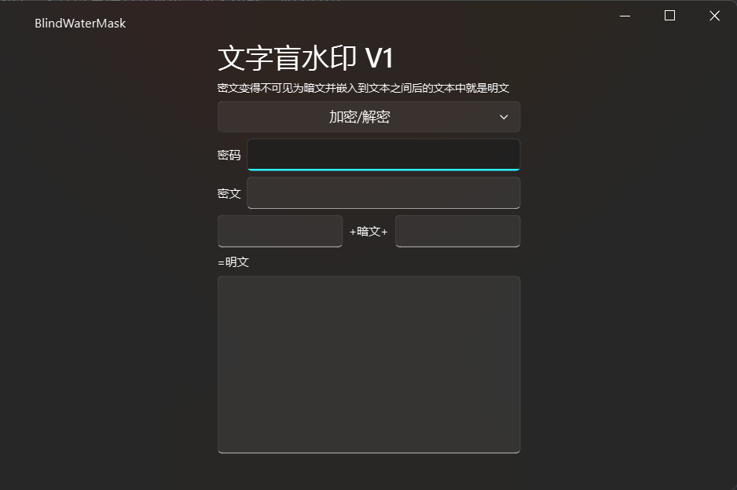
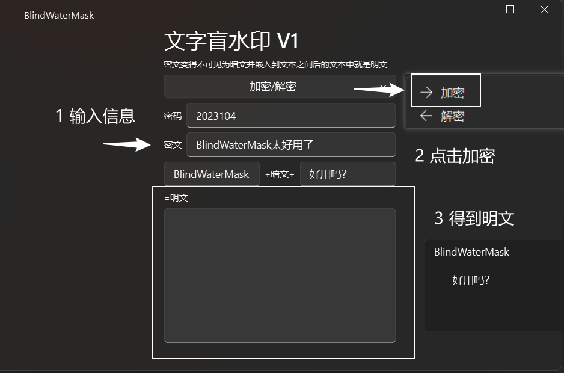
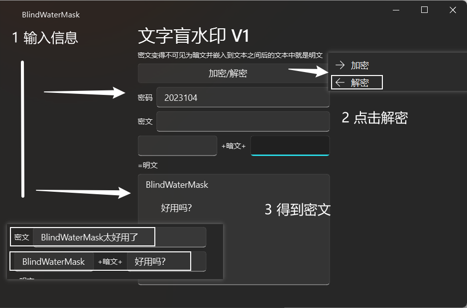
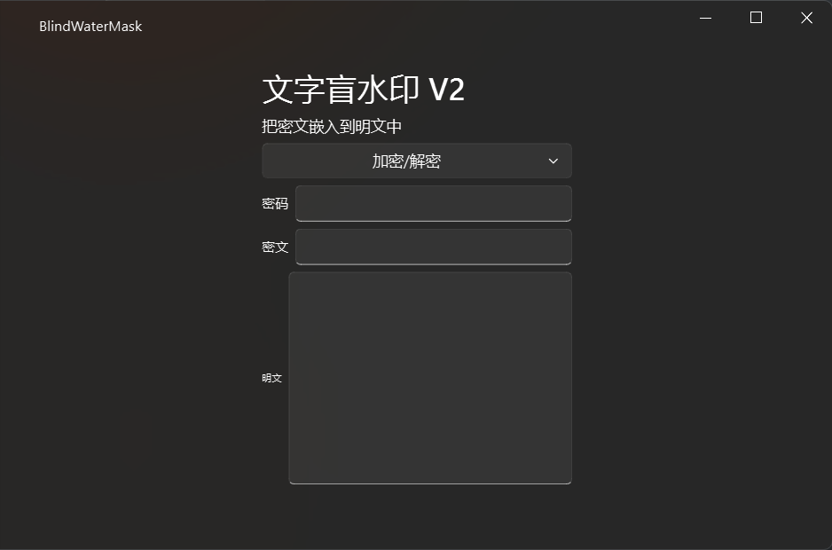
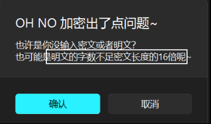
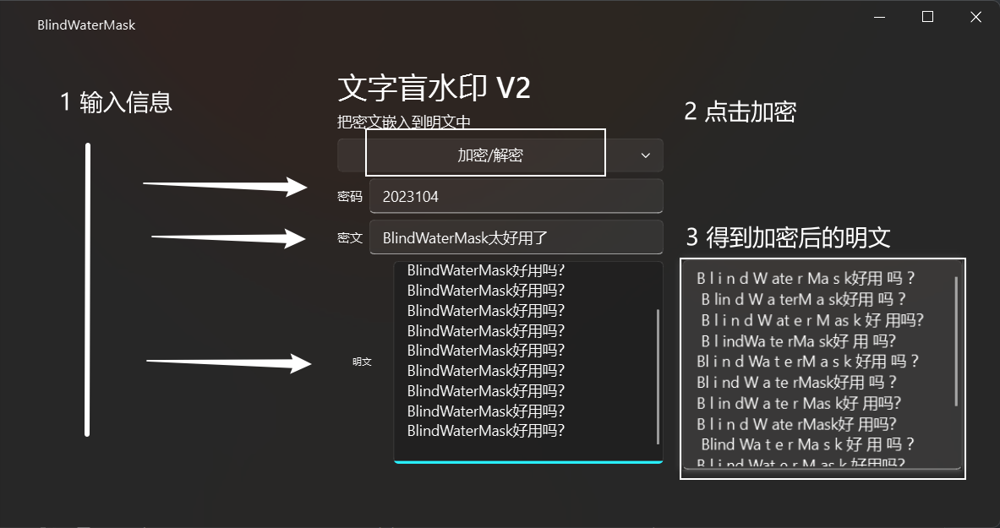
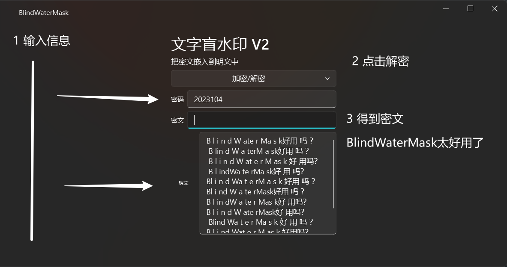
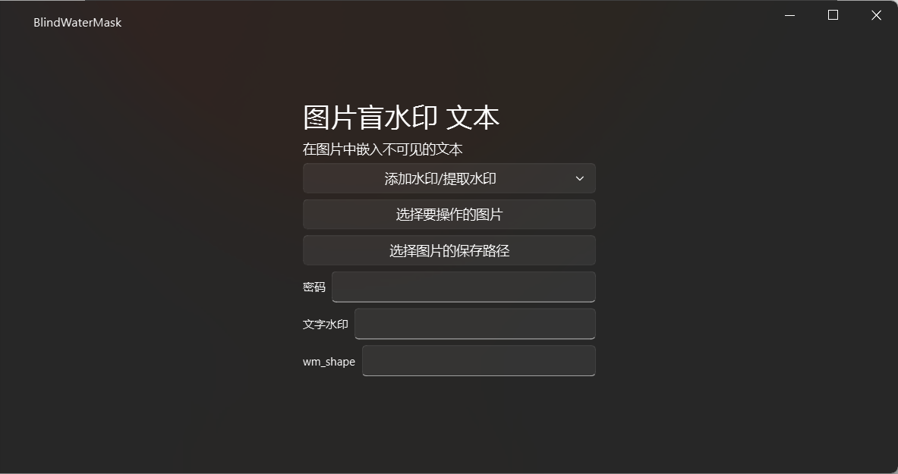

# 使用指南

## 使用之前

> 将文本、图片、文件以各种方式塞进一段文本或一张图片中。

你可以将这项技术用在各种地方，但产生的后果与本软件作者无关！不提供任何服务！

## 开始使用

本软件集成了4种盲水印方式：文字盲水印V1V2、图片盲水印 图片、图片盲水印 文本。

### 文字盲水印 V1

#### 简单介绍

1. 把密文变得不可见
   1. 使用密码加密密文
   2. 把密文变得不可见
2. 嵌入一段文本中间
   1. 文本1<small>(可见内容)</small>+密文<small>(不可见内容)</small>+文本2<small>(可见内容)</small>
3. 得到明文

#### 所需参数

- 密码 <small>加密 解密</small>
- 密文 <small>加密</small>
- 文本1、文本2 <small>加密</small>
- 明文 <small>解密</small>

#### 使用实例

##### 加密

##### 解密

### 文字盲水印 V2

#### 简单介绍

1. 把密文嵌入明文
   - 明文长度需要是密文长度的16倍
   - 
2. 得到明文

#### 所需参数

- 密码 <small>加密 解密</small>
- 密文 <small>加密</small>
- 明文 <small>加密 解密</small>

#### 使用实例

##### 加密

##### 解密

### 图片盲水印 文本

#### 简单介绍

1. 把密文（文字水印）嵌入图片
2. 得到添加了水印的图片和wm_shape（用于还原）

#### 使用步骤

##### 加密（添加水印）

1. 选择要操作的图片（需要添加水印的图片），选择图片（添加水印后的图片）的保存路径
2. 输入密文（文字水印）、密码（用于加密解密）
3. 点击添加水印
4. 在目录下生成“output.jpg”，即添加了水印的图片
5. 记住wm_shape和密码，否则无法提取

##### 解密（提取水印）

1. 选择要操作的图片（需要提取水印的图片）
2. 输入wm_shape、密码（用于加密解密）
3. 点击提取水印
4. 得到文字水印

#### 所需参数

> 加密=添加水印
>
> 解密=提取水印
>
> 无法删除水印

- 操作的图片 <small>加密 解密</small>
- 保存路径 <small>加密</small>
- 密文（文字水印） <small>加密</small>
- wm_shape <small>解密</small>

#### 使用实例

https://www.bilibili.com/video/BV12B4y1f7sk?t=23.4

### 图片盲水印 图片

#### 简单介绍

1. 把水印（图片水印）嵌入图片
2. 得到添加了水印的图片和wm_shape（用于还原）

#### 所需参数

> 加密=添加水印
>
> 解密=提取水印
>
> 无法删除水印

- 操作的图片 <small>加密 解密</small>
- 保存路径 <small>加密</small>
- 水印（图片水印） <small>加密</small>
- wm_shape <small>解密</small>

#### 使用步骤

##### 加密（添加水印）

1. 选择要操作的图片（需要添加水印的图片），选择图片（添加水印后的图片）的保存路径，选择要作为水印的图片
2. 输入密码（用于加密解密）
3. 点击添加水印
4. 如果发现水印图片过大，请使用图片压缩工具进行一键压缩
   1. 选择要操作的图片（需要压缩的图片），选择图片（压缩后图片）的保存路径
   2. 点击一键压缩
   3. 在目录下生成“output.jpg”，即压缩后的图片
5. 在目录下生成“output.jpg”，即添加了水印的图片
6. 记住wm_shape和密码，否则无法提取

##### 解密（提取水印）

1. 选择要操作的图片（需要提取水印的图片），选择图片（水印图片）的保存路径
2. 输入wm_shape、密码（用于加密解密）
3. 点击提取水印
4. 在目录下生成“output.jpg”，即提取出来的水印图片

#### 使用实例

https://www.bilibili.com/video/BV1dG41127oR?t=14.2